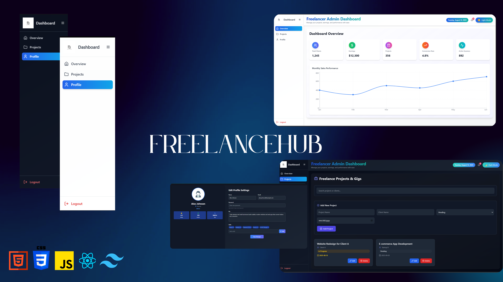

# 💼 Freelance Hub


A modern, responsive **freelancing dashboard application** built with **React**, **Tailwind CSS**, HTML, CSS, JavaScript, and **Vite** for lightning-fast development.  
It includes a **dashboard overview**, **profile management**, and **projects page**, designed for freelancers to track performance, manage skills, and update profile details.

# 🌐 Demo

Check out the live demo of this project, hosted on **Netlify**:  
[**View Demo**](https://startling-alfajores-372482.netlify.app/)

---
📸 Screenshots



## ✨ Features

### **Dashboard**
- 📊 **Sales performance chart** (Recharts integration).
- 📌 **KPI cards** for quick stats: Clients, Earnings, Projects, Conversion Rate, Active Sessions.
- 🎨 Responsive grid layout with hover animations.

### **Profile**
- 🖼 **Profile card** with avatar, location, hourly rate, ratings, and projects completed.
- ✏ **Editable profile settings** (Name, Email, Password, Bio, Skills).
- ➕ **Add / Remove skills** dynamically.
- 🌙 Dark mode support.

### **Projects**
- 📁 Placeholder for project management section.
- ⚡ Ready for integration with backend or APIs.

### **UI Components**
- 📌 Sidebar navigation with active states.
- 🌙 Theme toggle (light/dark mode).
- 🔔 Notification dropdown.

---

## 📂 Project Structure

freelance-hub/
├── public/
│ └── logo.svg
│
└── src/
├── App.jsx
├── index.css
├── main.jsx
│
├── assets/
│ ├── 5856.eps
│ ├── License free.txt
│ ├── License premium.txt
│ ├── logo.svg
│ ├── profile.jpg
│ └── react.svg
│
├── components/
│ ├── Header.jsx
│ ├── Navbar.jsx
│ ├── NotificationDropdown.jsx
│ ├── Sidebar.jsx
│ └── ThemeToggle.jsx
│
├── layouts/
│ └── DashboardLayouts.jsx
│
└── pages/
├── dashboard.jsx
├── Overview.jsx
├── Profile.jsx
└── Projects.jsx


---

## 🛠 Tech Stack

- **React** – component-based UI
- **Vite** – fast bundler and development server
- **Tailwind CSS** – utility-first CSS framework
- **HTML5** – semantic markup
- **CSS3** – styling
- **JavaScript (ES6+)** – dynamic functionality
- **Recharts** – data visualization
- **React Icons** & **Lucide Icons** – modern icons

---
# 🚀 Getting Started

Follow these steps to get the project up and running locally:

### 1️⃣ Clone the repository
```bash
git clone https://github.com/manailghouri/FreelanceHub.git
cd FreelanceHub


2️⃣ Install dependencies
npm run dev

3️⃣ Run the development server (using Vite)
npm run dev

4️⃣ Build for production
npm run build

📜 License
This project is licensed under the MIT License — feel free to modify and use it as you like.

🙌 Acknowledgements
Thanks to the amazing open-source tools and libraries used in this project:

React

Vite

Tailwind CSS

Recharts

React Icons

Lucide Icons


